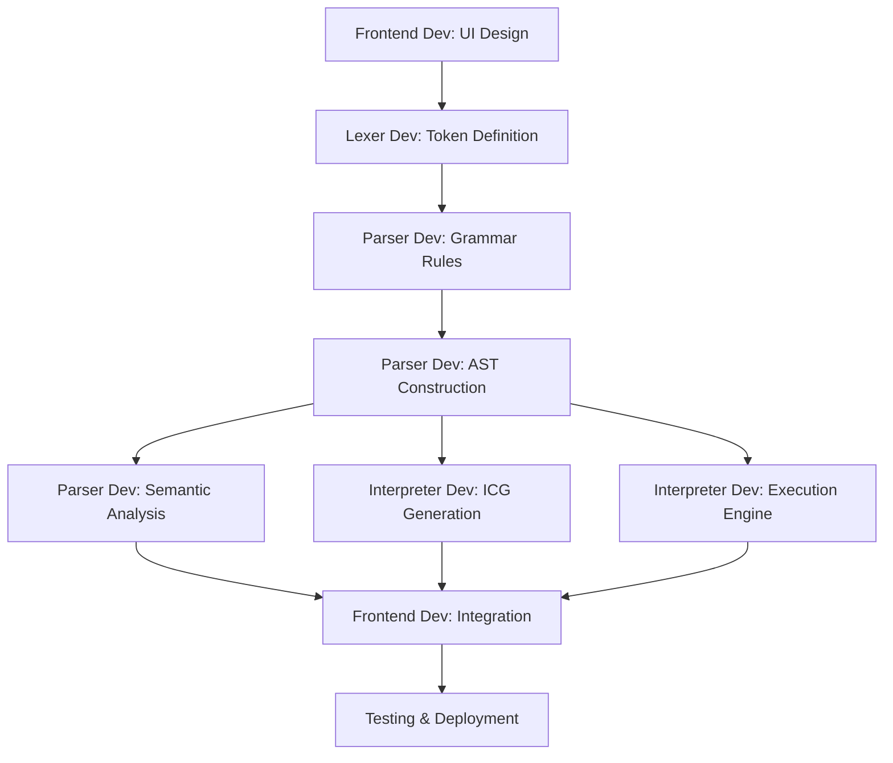

# 👥 Mini-Python Compiler Visualizer - Project Roles

## Team Structure & Responsibilities

This document outlines the four key roles in the Mini-Python Compiler Visualizer project, detailing each team member's contributions, responsibilities, and technical implementation areas.

---

## 🎯 Role 1: Frontend Developer & UI/UX Designer

### **Primary Responsibility**
Design and implement the interactive web interface using Streamlit, ensuring an intuitive and visually appealing user experience for exploring compiler concepts.

### **Key Contributions**

#### **1. Streamlit Application Architecture** ([app.py](app.py))
- Designed and developed the main web application entry point
- Implemented responsive layout with two-column design for code editor and visualization
- Created tabbed interface for different compilation phases
- Integrated custom CSS for dark theme and professional styling

#### **2. User Interface Components**
- **Code Editor**: Syntax-highlighted text area with monospace font
- **Control Panel**: Sidebar with example loader and educational tooltips
- **Visualization Tabs**: 
  - 📊 Lexer (Token Stream)
  - 🌳 Parser (AST Visualization)
  - 🛡️ Semantic Analysis
  - ⚙️ ICG (Intermediate Code)
  - 🏁 Output (Execution Results)

#### **3. Interactive Features**
- Example code loader with pre-built programs (factorial, loops, conditionals)
- Real-time pipeline execution with loading spinner
- Export functionality for tokens (CSV), AST (DOT), and ICG (TXT)
- Educational expandable sections explaining compiler concepts

#### **4. Data Visualization**
- Token display using Pandas DataFrames
- AST rendering with Graphviz integration
- Formatted code output display
- Error message presentation with color-coded alerts

### **Technical Skills Required**
- **Frontend**: Streamlit, HTML/CSS, Responsive Design
- **Data Visualization**: Pandas, Graphviz
- **UI/UX**: User flow design, accessibility, visual hierarchy
- **Python**: Session state management, component lifecycle

### **Files Owned**
```
├── app.py                      # Main Streamlit application
├── requirements.txt            # Frontend dependencies
└── samples/                    # Example programs for UI
    ├── factorial.py
    └── loops_lists.py
```

### **Key Achievements**
✅ Created professional dark-themed interface  
✅ Implemented 5-phase tabbed visualization system  
✅ Integrated export capabilities for all compiler outputs  
✅ Built educational tooltips for learning compiler theory  

---

## 🔤 Role 2: Lexical Analyzer Developer

### **Primary Responsibility**
Implement the tokenization phase of the compiler, breaking source code into meaningful lexical units (tokens) using PLY's lexer module.

### **Key Contributions**

#### **1. Token Definition** ([src/lexer.py](src/lexer.py))
- Defined comprehensive token set for Python subset:
  - **Keywords**: `def`, `if`, `else`, `for`, `while`, `return`, `print`, `try`, `except`, `in`, `range`
  - **Operators**: `+`, `-`, `*`, `/`, `%`, `==`, `!=`, `<`, `>`, `<=`, `>=`, `=`, `and`, `or`, `not`
  - **Delimiters**: `(`, `)`, `[`, `]`, `{`, `}`, `:`, `,`
  - **Literals**: Numbers, strings, identifiers

#### **2. Regular Expression Patterns**
- Implemented regex rules for token recognition
- Handled whitespace and indentation (critical for Python)
- String literal parsing with escape sequence support
- Number recognition (integers and floats)

#### **3. Lexical Error Handling**
- Illegal character detection
- Line and column tracking for error reporting
- Graceful error recovery mechanisms

#### **4. Token Stream Generation**
```python
def tokenize(code):
    """
    Converts source code into a list of tokens
    Returns: [{'type': 'KEYWORD', 'value': 'def', 'line': 1, 'column': 0}, ...]
    """
```

### **Technical Skills Required**
- **Lexical Analysis**: Regular expressions, finite automata
- **PLY Framework**: lex module, token rules, error handling
- **Pattern Matching**: Regex optimization, lookahead/lookbehind
- **Python**: String processing, generator functions

### **Files Owned**
```
└── src/
    └── lexer.py                # Lexical analyzer implementation
```

### **Key Achievements**
✅ Defined 40+ token types for Python subset  
✅ Implemented robust string and number parsing  
✅ Added line/column tracking for precise error reporting  
✅ Optimized regex patterns for performance  

---

## 🌳 Role 3: Parser & Semantic Analyzer Developer

### **Primary Responsibility**
Build the syntax analyzer (parser) to construct Abstract Syntax Trees and implement semantic analysis for type checking and scope validation.

### **Key Contributions**

#### **1. Grammar Definition** ([src/myparser.py](src/myparser.py))
- Designed context-free grammar for Python subset using BNF notation
- Implemented production rules for:
  - **Statements**: assignments, conditionals, loops, function definitions
  - **Expressions**: arithmetic, boolean, function calls
  - **Data Structures**: lists, dictionaries
  - **Control Flow**: if/else, for, while, try/except

#### **2. AST Construction** ([src/ast_nodes.py](src/ast_nodes.py))
- Defined node classes for all language constructs:
  ```python
  class FunctionDef(ASTNode)
  class IfStatement(ASTNode)
  class ForLoop(ASTNode)
  class BinaryOp(ASTNode)
  class Assignment(ASTNode)
  ```
- Implemented tree-building logic during parsing
- Added parent-child relationships for tree traversal

#### **3. Semantic Analysis** ([src/semantic_analyzer.py](src/semantic_analyzer.py))
- **Symbol Table Management**: Track variable declarations and scopes
- **Type Checking**: Validate type compatibility in operations
- **Scope Resolution**: Ensure variables are declared before use
- **Function Validation**: Check parameter counts and return statements

#### **4. AST Visualization** ([src/utils.py](src/utils.py))
- Implemented Graphviz-based tree rendering
- Created visual node representations with labels
- Generated DOT format output for export

### **Technical Skills Required**
- **Parsing Theory**: CFG, LR parsing, shift-reduce conflicts
- **PLY Framework**: yacc module, precedence rules, error recovery
- **Compiler Design**: AST design patterns, visitor pattern
- **Type Systems**: Static analysis, type inference

### **Files Owned**
```
└── src/
    ├── myparser.py             # Syntax analyzer (parser)
    ├── ast_nodes.py            # AST node definitions
    ├── semantic_analyzer.py    # Type & scope checker
    └── utils.py                # AST visualization utilities
```

### **Key Achievements**
✅ Implemented 30+ grammar production rules  
✅ Built comprehensive AST node hierarchy  
✅ Created symbol table with nested scope support  
✅ Developed interactive AST visualization with Graphviz  

---

## ⚙️ Role 4: Code Generator & Interpreter Developer

### **Primary Responsibility**
Implement intermediate code generation (Three-Address Code) and build the execution engine (tree-walking interpreter) to run the compiled programs.

### **Key Contributions**

#### **1. Intermediate Code Generation** ([src/icg_generator.py](src/icg_generator.py))
- **Three-Address Code (TAC) Generation**:
  ```
  t1 = 5
  t2 = 10
  t3 = t1 + t2
  print t3
  ```
- Implemented TAC for:
  - Arithmetic operations
  - Control flow (if/else, loops)
  - Function calls and returns
  - Array/list operations

#### **2. Temporary Variable Management**
- Automatic temporary variable allocation (`t1`, `t2`, `t3`, ...)
- Label generation for control flow (`L1`, `L2`, ...)
- Optimization opportunities identification

#### **3. Tree-Walking Interpreter** ([src/interpreter.py](src/interpreter.py))
- **Execution Engine**: Direct AST traversal and evaluation
- **Runtime Environment**:
  - Variable storage and retrieval
  - Function call stack management
  - Scope chain implementation
  
#### **4. Built-in Functions & Operations**
- **I/O Operations**: `print()`, input handling
- **Type Conversions**: `str()`, `int()`, `float()`
- **Data Structures**: List operations, dictionary methods
- **Control Flow**: Loop execution, conditional branching
- **Exception Handling**: Try/except block execution

#### **5. Runtime Error Handling**
- Division by zero detection
- Undefined variable access
- Type mismatch errors
- Stack overflow prevention (recursion depth)

### **Technical Skills Required**
- **Code Generation**: TAC, SSA form, optimization techniques
- **Interpreter Design**: AST traversal, visitor pattern, runtime environments
- **Memory Management**: Stack frames, heap allocation, garbage collection concepts
- **Python**: Advanced data structures, recursion, exception handling

### **Files Owned**
```
└── src/
    ├── icg_generator.py        # Intermediate code generator
    └── interpreter.py          # Tree-walking interpreter
```

### **Key Achievements**
✅ Generated optimized Three-Address Code  
✅ Built fully functional tree-walking interpreter  
✅ Implemented recursion support with proper stack management  
✅ Added exception handling (try/except) execution  
✅ Supported lists, dictionaries, and complex data structures  

---

## 📊 Role Collaboration Matrix

| Phase | Frontend Dev | Lexer Dev | Parser Dev | Interpreter Dev |
|-------|-------------|-----------|------------|-----------------|
| **Lexical Analysis** | Display tokens | Generate tokens | - | - |
| **Syntax Analysis** | Render AST | - | Build AST | - |
| **Semantic Analysis** | Show errors | - | Validate types | - |
| **Code Generation** | Display ICG | - | - | Generate TAC |
| **Execution** | Show output | - | - | Execute code |

---

## 🔄 Integration Points

### **Frontend ↔ Lexer**
```python
tokens = tokenize(code)  # Lexer provides tokens
df = pd.DataFrame(tokens)  # Frontend displays in table
```

### **Lexer ↔ Parser**
```python
ast = parser.parse(code)  # Parser consumes tokens from lexer
```

### **Parser ↔ Semantic Analyzer**
```python
is_valid, output = semantic_analysis(ast)  # Validates AST
```

### **Parser ↔ Code Generator**
```python
icg_output = generate_icg(ast)  # Generates TAC from AST
```

### **Parser ↔ Interpreter**
```python
interpreter.execute(code)  # Executes AST directly
```

---

## 🎓 Learning Outcomes by Role

### **Frontend Developer**
- Web application architecture with Streamlit
- Data visualization techniques
- User experience design for technical tools

### **Lexer Developer**
- Regular expression mastery
- Finite automata and state machines
- Tokenization algorithms

### **Parser Developer**
- Context-free grammars
- AST design patterns
- Type systems and semantic analysis

### **Interpreter Developer**
- Runtime environment design
- Memory management concepts
- Code optimization techniques

---

## 🛠️ Development Workflow



---

## 📝 Contribution Guidelines by Role

### **For Frontend Developers**
- Maintain consistent UI/UX across all tabs
- Ensure responsive design for different screen sizes
- Add helpful tooltips and documentation
- Test export functionality thoroughly

### **For Lexer Developers**
- Keep token definitions synchronized with parser
- Optimize regex patterns for performance
- Provide detailed error messages with line numbers
- Document all token types

### **For Parser Developers**
- Maintain clean grammar without conflicts
- Design extensible AST node hierarchy
- Implement comprehensive error recovery
- Keep semantic rules consistent

### **For Interpreter Developers**
- Ensure runtime safety (no crashes)
- Optimize execution performance
- Handle edge cases gracefully
- Provide clear runtime error messages

---

## 🚀 Future Enhancements by Role

### **Frontend**
- [ ] Add code syntax highlighting in editor
- [ ] Implement step-by-step execution debugger
- [ ] Add performance metrics visualization
- [ ] Create mobile-responsive version

### **Lexer**
- [ ] Support for comments
- [ ] Multi-line string literals
- [ ] Unicode identifier support
- [ ] Better whitespace handling

### **Parser**
- [ ] Class and object support
- [ ] Decorator syntax
- [ ] List comprehensions
- [ ] Lambda functions

### **Interpreter**
- [ ] Bytecode compilation
- [ ] JIT optimization
- [ ] Garbage collection
- [ ] Async/await support

---

<div align="center">

## 🤝 Team Collaboration

**Each role is critical to the project's success. Effective communication and integration between roles ensures a robust, educational, and professional compiler visualizer.**

*Built with collaboration and passion for compiler design* ❤️

</div>
