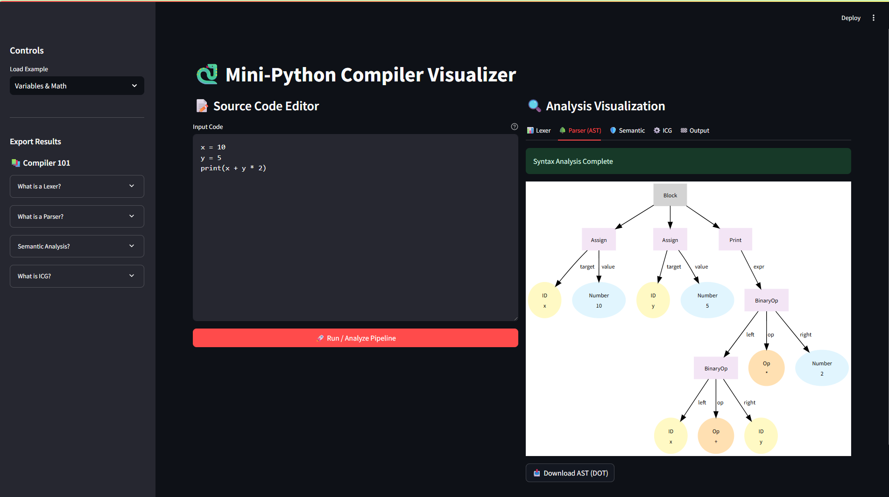

<div align="center">

# 🐍 Mini-Python Compiler Visualizer

### *A Modern, Interactive Compiler Pipeline Explorer*

[](https://www.python.org/)
[](https://streamlit.io/)
[](https://www.dabeaz.com/ply/)
[](LICENSE)

**Explore how Python code transforms through each compiler phase** — from raw text to executable instructions — with stunning real-time visualizations.

[Features](#-features) • [Demo](#-demo) • [Installation](#-installation) • [Usage](#-usage) • [Architecture](#-architecture) • [Examples](#-examples)

---

</div>

## 🌟 Overview

**Mini-Python Compiler Visualizer** is an educational and professional-grade tool that demystifies compiler design. Built with **Streamlit** and **PLY (Python Lex-Yacc)**, it provides an interactive web interface to visualize every stage of the compilation process for a robust subset of Python.

Whether you're a **student learning compiler theory**, a **developer exploring language design**, or an **educator teaching programming languages**, this tool offers unprecedented insight into how code is analyzed, transformed, and executed.

---

## ✨ Features

### 🔍 **Complete Compiler Pipeline**
- **Lexical Analysis** — Tokenize source code into meaningful symbols
- **Syntax Analysis** — Build Abstract Syntax Trees (AST) with interactive Graphviz visualization
- **Semantic Analysis** — Validate type safety, scope rules, and variable declarations
- **Intermediate Code Generation** — Generate Three-Address Code (TAC) for optimization
- **Execution** — Run code using a custom tree-walking interpreter

### 🎨 **Interactive Web Interface**
- **Live Code Editor** with syntax highlighting
- **Tabbed Pipeline View** for each compilation phase
- **Export Capabilities** — Download tokens (CSV), AST (DOT), and ICG (TXT)
- **Pre-loaded Examples** — Factorial, loops, lists, conditionals, and more
- **Educational Tooltips** — Built-in compiler theory explanations

### 🚀 **Robust Language Support**
- ✅ Variables & Arithmetic Operations
- ✅ Conditional Statements (`if`/`else`)
- ✅ Loops (`for`, `while`)
- ✅ Functions & Recursion
- ✅ Lists & Dictionaries
- ✅ Exception Handling (`try`/`except`)
- ✅ String Operations & Type Conversions

---

## 📸 Demo

<div align="center">

### **Compiler Pipeline in Action**

#### **Lexical Analysis - Token Stream**

*Tokenization of source code into structured lexical units*

#### **Syntax Analysis - Abstract Syntax Tree**

*Interactive AST visualization using Graphviz*

#### **Program Execution - Output**

*Real-time code execution with interpreter output*

---

*Experience the complete transformation from source code to executable output*

</div>

---

## 🛠️ Installation

### **Prerequisites**
- **Python 3.8+** installed on your system
- **Graphviz** (optional, for AST visualization)
  - Windows: Download from [graphviz.org](https://graphviz.org/download/)
  - macOS: `brew install graphviz`
  - Linux: `sudo apt-get install graphviz`

### **Setup Steps**

1. **Clone the Repository**
   ```bash
   git clone https://github.com/yourusername/mini-python-compiler.git
   cd mini-python-compiler
   ```

2. **Install Dependencies**
   ```bash
   pip install -r requirements.txt
   ```

3. **Launch the Application**
   ```bash
   streamlit run app.py
   ```

4. **Open in Browser**
   - Navigate to `http://localhost:8501`
   - Start exploring the compiler pipeline!

---

## 🎮 Usage

### **Quick Start**

1. **Load an Example** from the sidebar (e.g., "Factorial" or "Loops")
2. **Edit the Code** in the source editor
3. **Click "Run / Analyze Pipeline"** to process the code
4. **Explore Each Phase** using the tabbed interface:
   - 📊 **Lexer** — View tokenized output
   - 🌳 **Parser** — Visualize the AST
   - 🛡️ **Semantic** — Check for errors
   - ⚙️ **ICG** — See intermediate code
   - 🏁 **Output** — View execution results

### **Example Code**

```python
# Recursive Factorial Function
def factorial(n):
    if n <= 1:
        return 1
    else:
        return n * factorial(n - 1)

print("Factorial of 5 is:")
print(factorial(5))
```

**Output:**
```
Factorial of 5 is:
120
```

---

## 📂 Project Structure

```
mini-python-compiler/
│
├── app.py                      # 🚀 Streamlit Web Application Entry Point
├── requirements.txt            # 📦 Python Dependencies
│
├── src/                        # 🧠 Core Compiler Components
│   ├── __init__.py
│   ├── lexer.py                # 🔤 Lexical Analyzer (Tokenizer)
│   ├── myparser.py             # 🌳 Syntax Analyzer (Parser)
│   ├── ast_nodes.py            # 📐 AST Node Definitions
│   ├── semantic_analyzer.py   # 🛡️ Type & Scope Checker
│   ├── icg_generator.py        # ⚙️ Intermediate Code Generator
│   ├── interpreter.py          # 🏃 Tree-Walking Interpreter
│   └── utils.py                # 🎨 AST Visualization Utilities
│
├── samples/                    # 📝 Example Programs
│   ├── factorial.py
│   └── loops_lists.py
│
└── README.md                   # 📖 You Are Here
```

---

## 🏗️ Architecture

### **Compilation Pipeline**


### **Technology Stack**

| Component | Technology | Purpose |
|-----------|-----------|---------|
| **Frontend** | Streamlit | Interactive web interface |
| **Lexer** | PLY (lex) | Tokenization & pattern matching |
| **Parser** | PLY (yacc) | Grammar-based syntax analysis |
| **Visualization** | Graphviz | AST rendering |
| **Execution** | Custom Interpreter | Code execution engine |

---

## 📚 Examples

### **1. Variables & Arithmetic**
```python
x = 10
y = 5
print(x + y * 2)  # Output: 20
```

### **2. Conditional Logic**
```python
age = 18
if age >= 18:
    print("Adult")
else:
    print("Minor")
```

### **3. Loops & Lists**
```python
numbers = [1, 2, 3, 4, 5]
sum = 0
for n in numbers:
    sum = sum + n
print(sum)  # Output: 15
```

### **4. Functions & Recursion**
```python
def fibonacci(n):
    if n <= 1:
        return n
    return fibonacci(n-1) + fibonacci(n-2)

print(fibonacci(7))  # Output: 13
```

---

## 🧪 Testing

Run the test suite to verify compiler functionality:

```bash
# Run all tests
pytest test_compiler.py

# Run specific test
pytest test_my_interpreter.py -v
```

---

## 🎓 Educational Use

This project is perfect for:

- **Compiler Design Courses** — Visualize theoretical concepts
- **Programming Language Theory** — Understand parsing and semantics
- **Self-Learning** — Explore how interpreters work under the hood
- **Portfolio Projects** — Showcase full-stack compiler knowledge

### **Learning Resources**

- 📖 [PLY Documentation](https://www.dabeaz.com/ply/ply.html)
- 📖 [Compiler Design Principles](https://en.wikipedia.org/wiki/Compilers:_Principles,_Techniques,_and_Tools)
- 📖 [Abstract Syntax Trees](https://en.wikipedia.org/wiki/Abstract_syntax_tree)

---

## 🤝 Contributing

Contributions are welcome! Here's how you can help:

1. **Fork the Repository**
2. **Create a Feature Branch** (`git checkout -b feature/AmazingFeature`)
3. **Commit Changes** (`git commit -m 'Add some AmazingFeature'`)
4. **Push to Branch** (`git push origin feature/AmazingFeature`)
5. **Open a Pull Request**

### **Ideas for Contribution**
- Add support for classes and objects
- Implement code optimization passes
- Add more visualization options
- Improve error messages
- Add more example programs

---

## 🐛 Known Limitations

- Limited to a subset of Python (no imports, decorators, or async)
- AST visualization requires Graphviz installation
- No bytecode generation (uses tree-walking interpreter)

---

## 📄 License

This project is licensed under the **MIT License** — see the [LICENSE](LICENSE) file for details.

---

## 👨‍💻 Author

**Karan**

- GitHub: [@yourusername](https://github.com/yourusername)
- LinkedIn: [Your Profile](https://linkedin.com/in/yourprofile)

---

## 🙏 Acknowledgments

- **PLY (Python Lex-Yacc)** by David Beazley
- **Streamlit** for the amazing web framework
- **Graphviz** for graph visualization
- The compiler design community for inspiration

---

<div align="center">

### ⭐ Star this repository if you found it helpful!

**Made with ❤️ and Python**

[Report Bug](https://github.com/yourusername/mini-python-compiler/issues) • [Request Feature](https://github.com/yourusername/mini-python-compiler/issues)

</div>
